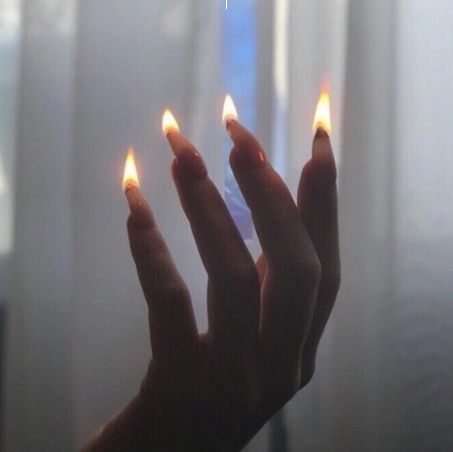

# Le Groupe 

Frère et sœur, Valentin et Clara Vandevoorde forment en 2022 le duo aciddelmar, entre Paris et Pornic. Leur premier single, « Losing Time in Manhattan », paraît au printemps 2023.
 
En avril 2024, ils dévoilent une nouvelle double sortie : « Found MySpace / virtuallove ».
 
Acid del Mar propose un live/DJ set aux sonorités marquées par des influences hip-hop et soul, pour une expérience à la fois planante et rythmée.

# Leur musique

