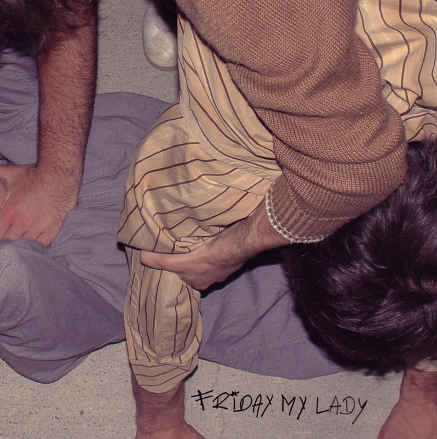

# Le Groupe
Friday My Lady, c'est avant tout une rencontre de lycée en 2022, 4 jeunes vendéens de 18 ans, aujourd'hui étudiants avec pour ambition de vivre de la musique: Lény Giraud à la batterie, Balthazar Helbert Cartagena à la basse, Vérone Attard à la guitare lead, Mathis chevrier à la guitare rythmique et à la voix. 4 membres, qui, par la musique et la motivation du punk et du garage rock, ont décidé de se retrouver et de répéter dans un garage  pour jouer la musique qui les anime. Tous influencés par le punk et le garage avec des groupes tels que Artic Monkers, The libertines, Sonic Youth en passant par Stiff Richards, Amyl and the Sniffers et les influences des 70's. 

Friday My Lady, c'est la fusion entre deux guitares saturées et parfois dissonantes et d'un combo basse batterie hyper efficace et dansant. Aujourd'hui, le groupe a environ une trentaine de dates à son actif et un EP "Garage Recordings" enregistré dans le studio "the Analog Seeds" qui est maintenant disponible sur toutes les plateformes de steaming depuis le 22 Novembre 2024. 

# Leur musique

##### Un EP : Garage Recordings

